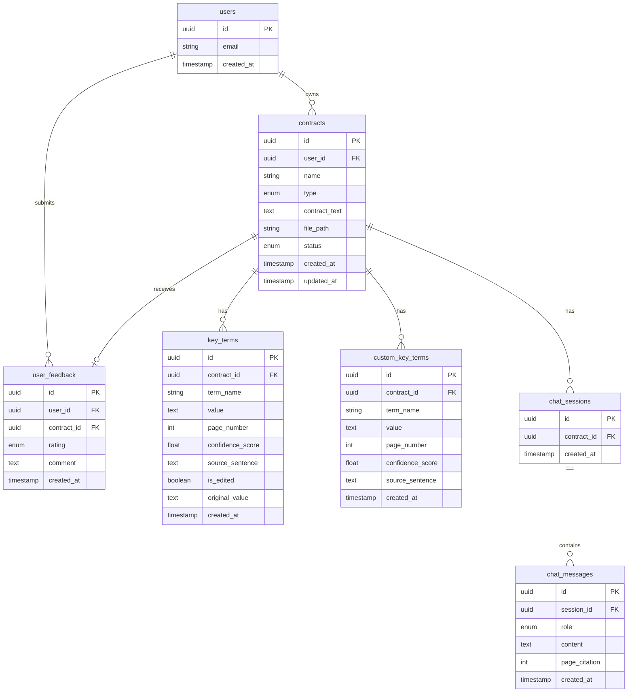

# ContractIQ — Engineering Document

**Version:** 1.0
**Date:** July 2026
**Status:** Draft
**Source PRD:** `docs/ContractIQ_PRD.md`

---

## Table of Contents

1. [Executive Summary](#1-executive-summary)
2. [Product Scope](#2-product-scope)
3. [User Personas](#3-user-personas)
4. [User Flows](#4-user-flows)
5. [Frontend Architecture](#5-frontend-architecture)
6. [Backend Architecture](#6-backend-architecture)
7. [Database Design](#7-database-design)
8. [AI Architecture](#8-ai-architecture)
9. [API Specification](#9-api-specification)
10. [Feature Breakdown](#10-feature-breakdown)
11. [Folder Structure](#11-folder-structure)
12. [Naming Conventions](#12-naming-conventions)
13. [Testing Strategy](#13-testing-strategy)
14. [Specs to Implementation Mapping](#14-specs-to-implementation-mapping)

---

## 1. Executive Summary

### Project Name
**ContractIQ** — AI-Powered Contract Review for SMBs

### Business Goal
Reduce contract review time from 90 minutes to under 15 minutes by automating key term extraction from NDAs and MSAs with AI-powered analysis, confidence scoring, and interactive Q&A.

### Problem Statement
Business professionals without in-house legal teams spend 90–120 minutes manually reviewing contracts, often missing critical obligations, unfavorable terms, or auto-renewal clauses. Existing tools require legal expertise or produce generic summaries without page-level attribution or confidence scoring.

### Target Users
1. **Primary:** Founders, COOs, Procurement Managers at SMBs (5–250 employees) reviewing 5–15 NDAs/MSAs per month
2. **Secondary:** Freelancers and consultants receiving 1–4 client contracts per month

### Success Criteria

| Metric | Baseline | Target |
|--------|----------|--------|
| Time to complete review | 90 min | ≤ 15 min |
| Key-term extraction F1 score | 0% | ≥ 88% (NDA), ≥ 85% (MSA) |
| Time to first result (P95) | — | ≤ 30 seconds |
| Chat response latency (P95) | — | ≤ 15 seconds |
| 30-day user retention | — | ≥ 45% |
| User correction rate | — | ≤ 12% of extracted terms |
| Cost per analysis | — | ≤ $0.25 per 20-page contract |

---

## 2. Product Scope

### In Scope (MVP)

- Email/password authentication via Supabase Auth
- PDF upload (max 10 MB, 20 pages, text-layer only)
- Contract type selection (NDA or MSA)
- Automatic key term extraction using GPT-4o
- Confidence scoring (0–100%) per extracted term
- Page number attribution with source sentence
- Custom key term addition (up to 5 terms)
- Inline PDF viewer with page navigation
- Contract chat with document-grounded responses
- Dashboard with contract history
- Inline term editing with correction tracking
- Feedback submission (thumbs up/down + comment)

### Out of Scope (MVP)

- Scanned/image PDF support (OCR)
- Non-English contracts
- Non-US/UK contract conventions
- Batch upload (multiple contracts)
- Team workspaces / multi-user accounts
- Export to CSV/PDF (P2 feature)
- Contract comparison view
- Email notifications
- Mobile-native apps

### Future Enhancements (Post-MVP)

| Version | Features |
|---------|----------|
| v1.1 | Export to CSV/PDF, batch upload (up to 5), dashboard analytics |
| v1.2 | Scanned PDF support (OCR), contract comparison, email notifications, team workspaces |

---

## 3. User Personas

### Primary Persona: Time-Pressed Founder / Ops Lead

| Attribute | Value |
|-----------|-------|
| Industry | SaaS, agency, professional services, fintech, e-commerce |
| Role | Founder, COO, Procurement Manager, Legal Operations Manager |
| Company size | 5–250 employees, no in-house legal counsel |
| Contract volume | 5–15 NDAs or MSAs per month |
| Current behavior | Google searches, ad-hoc legal consultations ($250–$500/hr) |
| Pain points | 90–120 min per review, missed obligations (auto-renewal, IP assignment), high legal costs |

**Primary workflows:**
1. Upload a new vendor NDA and extract key terms before signing
2. Review an incoming MSA from a client, verify payment terms and liability caps
3. Revisit a previously reviewed contract to check a specific clause via chat

### Secondary Persona: Freelancer / Consultant

| Attribute | Value |
|-----------|-------|
| Industry | Design, marketing, software development, consulting |
| Role | Individual contributor signing client contracts |
| Contract volume | 1–4 MSAs per month from larger clients |
| Current behavior | Signs without reading carefully due to power imbalance |
| Pain points | Cannot afford legal review, unsure which clauses are risky |

**Primary workflows:**
1. Upload a client MSA and identify non-standard or risky terms
2. Ask questions about specific clauses ("Is there a non-compete?")

---

## 4. User Flows

### Flow 1: New Visitor → Sign Up → Dashboard

```
User Action              → Frontend Behavior           → Backend Processing        → Database Interaction           → System Response
─────────────────────────────────────────────────────────────────────────────────────────────────────────────────────────────────────
Land on marketing page   → Render landing page         → —                         → —                              → Display value prop, demo GIF
Click "Get Started Free" → Open Supabase Auth modal    → —                         → —                              → Show email/password form
Submit signup form       → Call Supabase Auth signUp   → Supabase creates user     → INSERT into auth.users         → Return session token
Auth success             → Store session, redirect     → —                         → —                              → Navigate to /dashboard
Load dashboard           → Fetch user contracts        → Query contracts table     → SELECT * FROM contracts        → Render empty state message
                                                                                      WHERE user_id = $1
```

### Flow 2: Returning User → Dashboard

```
User Action              → Frontend Behavior           → Backend Processing        → Database Interaction           → System Response
─────────────────────────────────────────────────────────────────────────────────────────────────────────────────────────────────────
Navigate to app          → Check Supabase session      → Validate JWT              → —                              → If valid, proceed; else redirect to login
Load dashboard           → Fetch user contracts        → Query contracts table     → SELECT id, name, type, status, → Render contract list with stats
                                                                                      created_at FROM contracts
                                                                                      WHERE user_id = $1
                                                                                      ORDER BY created_at DESC
Click contract row       → Navigate to results page    → —                         → —                              → Load /contracts/[id]
```

### Flow 3: Core Flow — Contract Review

```
User Action              → Frontend Behavior           → Backend Processing        → Database Interaction           → System Response
─────────────────────────────────────────────────────────────────────────────────────────────────────────────────────────────────────
Click "Review Contract"  → Navigate to /upload         → —                         → —                              → Render upload page
Select contract type     → Store in local state        → —                         → —                              → Show NDA/MSA dropdown
                           (NDA or MSA)
Drag/drop or select PDF  → Validate file (size, type)  → —                         → —                              → If invalid, show error; else proceed
Click "Upload"           → Show progress indicator     → POST /api/contracts/upload→ INSERT into contracts          → Return contract_id
                           (Step 1: Uploading)         → pdf-parse extracts text     (id, user_id, name, type,
                                                       → Store PDF in Supabase       contract_text, file_path,
                                                         Storage (optional)          status='uploaded')
Upload complete          → Show key terms preview      → —                         → —                              → Display standard terms to be extracted
                           (Step 2: Preview)                                                                            based on contract type
Add custom terms         → Append to custom terms list → —                         → —                              → Show custom terms with "Custom" badge
(optional, up to 5)
Click "Process Contract" → Show progress indicator     → POST /api/contracts/      → INSERT into custom_key_terms   → Begin OpenAI extraction
                           (Step 3: Analyzing)           [id]/process                (for custom terms)
                                                       → Build prompt with contract
                                                         text + term list
                                                       → Call OpenAI GPT-4o
                                                       → Parse JSON response
                                                       → Update contracts.status   → UPDATE contracts SET status=   → —
                                                                                      'processed'
                                                       → Store extracted terms     → INSERT into key_terms          → Return extraction results
                                                                                      (contract_id, term_name,
                                                                                       value, page_number,
                                                                                       confidence_score,
                                                                                       source_sentence)
Processing complete      → Navigate to results page    → —                         → —                              → Load /contracts/[id]
Load results page        → Fetch contract + terms      → GET /api/contracts/[id]   → SELECT from contracts,         → Render two-panel layout
                                                                                      key_terms WHERE contract_id=$1
                         → Render PDF viewer (left)    → Get signed URL from       → —                              → Load PDF.js with signed URL
                                                         Supabase Storage
                         → Render key terms panel      → —                         → —                              → Show term list with confidence colors
                           (right)
Click page number        → Scroll PDF to page          → —                         → —                              → Smooth scroll + highlight
Click term to edit       → Show inline edit input      → —                         → —                              → Pre-fill with current value
Save edited term         → PATCH term value            → PATCH /api/contracts/     → UPDATE key_terms SET value=    → Show "Edited" badge
                                                         [id]/terms/[termId]         $1, is_edited=true,
                                                                                      original_value=$2
```

### Flow 4: Chat with Contract

```
User Action              → Frontend Behavior           → Backend Processing        → Database Interaction           → System Response
─────────────────────────────────────────────────────────────────────────────────────────────────────────────────────────────────────
Click "Chat" tab         → Show chat interface         → —                         → —                              → Load existing messages (if any)
                         → Fetch chat history          → GET /api/contracts/       → SELECT * FROM chat_messages    → Render message bubbles
                                                         [id]/chat                   WHERE session_id IN
                                                                                     (SELECT id FROM chat_sessions
                                                                                      WHERE contract_id=$1)
Type question            → Store in input state        → —                         → —                              → Enable "Send" button
Click "Send"             → Add user message to UI      → POST /api/contracts/      → INSERT into chat_messages      → Show loading indicator
                           (optimistic)                  [id]/chat                   (session_id, role='user',
                                                                                      content=$1)
                                                       → Get/create chat_session   → SELECT or INSERT chat_sessions → —
                                                       → Fetch full contract_text  → SELECT contract_text FROM      → —
                                                                                      contracts WHERE id=$1
                                                       → Fetch conversation history→ SELECT * FROM chat_messages    → —
                                                                                      WHERE session_id=$1
                                                                                      ORDER BY created_at ASC
                                                                                      LIMIT 200
                                                       → Build OpenAI prompt:      → —                              → —
                                                         system: "Answer only from
                                                         the document. Cite pages."
                                                         + contract_text
                                                         + conversation history
                                                       → Call OpenAI GPT-4o        → —                              → —
                                                       → Parse response            → —                              → —
                                                       → Store assistant message   → INSERT into chat_messages      → Return response
                                                                                      (session_id, role='assistant',
                                                                                       content=$1, page_citation=$2)
Response received        → Add assistant message to UI → —                         → —                              → Render with page citation link
Click page citation      → Scroll PDF viewer to page   → —                         → —                              → Highlight relevant section
```

---

## 5. Frontend Architecture

### Technology Stack

| Layer | Technology | Purpose |
|-------|------------|---------|
| Framework | Next.js 14 (App Router) | Server components, API routes, file-based routing |
| UI Library | React 18 | Component-based UI |
| Styling | Tailwind CSS | Utility-first CSS, design system tokens |
| State Management | React Context + useState | Auth context, local component state |
| Data Fetching | TanStack Query (React Query) | Server state, caching, optimistic updates |
| PDF Rendering | PDF.js (pdfjs-dist) | Client-side PDF viewer |
| Forms | React Hook Form + Zod | Form state, validation |
| Auth | Supabase Auth (supabase-js) | Session management, auth helpers |

### UX States

Each interactive component handles these states:

| State | Implementation |
|-------|----------------|
| Loading | Skeleton loaders, progress indicators with step labels |
| Empty | Friendly empty state messages with CTAs |
| Error | Toast notifications + inline error messages with retry options |
| Success | Success toasts, visual confirmation (checkmarks, badges) |
| Responsive | Mobile-first Tailwind breakpoints (sm, md, lg, xl) |
| Accessibility | WCAG 2.1 AA: focus rings, aria labels, keyboard navigation |

### Page Hierarchy

```
/                           → Landing page (marketing)
├── /login                  → Sign in page
├── /signup                 → Sign up page
├── /dashboard              → Protected: contract history, stats
├── /upload                 → Protected: file upload + type selection + custom terms
└── /contracts/[id]         → Protected: results page (PDF viewer + key terms + chat)
```

### Component Hierarchy

```
app/
├── layout.tsx                 → Root layout (providers, global styles)
├── page.tsx                   → Landing page
├── (auth)/
│   ├── login/page.tsx         → Login form
│   └── signup/page.tsx        → Signup form
├── (protected)/
│   ├── layout.tsx             → Auth guard, dashboard shell
│   ├── dashboard/page.tsx     → Dashboard view
│   ├── upload/page.tsx        → Upload flow
│   └── contracts/[id]/page.tsx→ Results page
│
components/
├── ui/                        → Primitives (Button, Input, Card, Badge, Tooltip, etc.)
├── auth/                      → AuthForm, AuthGuard
├── dashboard/                 → ContractList, ContractCard, StatsCard
├── upload/                    → FileDropzone, ContractTypeSelector, CustomTermInput
├── results/                   → PDFViewer, TextViewer, KeyTermsPanel, KeyTermRow, ConfidenceBadge
├── chat/                      → ChatInterface, ChatMessage, ChatInput
└── feedback/                  → FeedbackForm, RatingButtons
```

### State Management

| State Type | Solution | Scope |
|------------|----------|-------|
| Auth/session | Supabase Auth + React Context | Global |
| Server data | TanStack Query | Per-route, cached |
| Form state | React Hook Form | Per-form |
| UI state (modals, tabs) | useState/useReducer | Per-component |
| PDF viewer state | useState + refs | PDFViewer component |

---

## 6. Backend Architecture

### Technology Stack

| Layer | Technology | Purpose |
|-------|------------|---------|
| API Routes | Next.js Route Handlers | RESTful endpoints under /api |
| Runtime | Node.js (Vercel Edge/Serverless) | API execution |
| Database | Supabase PostgreSQL | Primary data store |
| Storage | Supabase Storage | PDF file storage |
| Auth | Supabase Auth | JWT validation, session management |
| LLM | OpenAI API (GPT-4o) | Key term extraction, chat |
| PDF Parsing | pdf-parse | Text extraction from PDFs |

### Core Systems

```mermaid
flowchart TB
    subgraph Client
        FE[Next.js Frontend]
    end

    subgraph "Next.js API Routes"
        AUTH[Auth Middleware]
        UPLOAD[/api/contracts/upload]
        PROCESS[/api/contracts/process]
        CONTRACTS[/api/contracts/[id]]
        TERMS[/api/contracts/[id]/terms]
        CHAT[/api/contracts/[id]/chat]
        FEEDBACK[/api/contracts/[id]/feedback]
        DASHBOARD[/api/dashboard]
    end

    subgraph Services
        PDF[PDF Service]
        AI[OpenAI Service]
        STORAGE[Storage Service]
    end

    subgraph Supabase
        DB[(PostgreSQL)]
        BUCKET[Storage Bucket]
        SAUTH[Supabase Auth]
    end

    subgraph External
        OPENAI[OpenAI API]
    end

    FE --> AUTH
    AUTH --> UPLOAD & PROCESS & CONTRACTS & TERMS & CHAT & FEEDBACK & DASHBOARD

    UPLOAD --> PDF --> DB
    UPLOAD --> STORAGE --> BUCKET

    PROCESS --> AI --> OPENAI
    PROCESS --> DB

    CHAT --> AI
    CHAT --> DB

    TERMS --> DB
    FEEDBACK --> DB
    DASHBOARD --> DB

    AUTH --> SAUTH
```

### Service Layer

| Service | Responsibility |
|---------|----------------|
| `lib/services/pdf.ts` | PDF text extraction with page markers |
| `lib/services/openai.ts` | Prompt construction, API calls, response parsing |
| `lib/services/storage.ts` | Supabase Storage operations, signed URL generation |
| `lib/services/contracts.ts` | Contract CRUD, term operations |
| `lib/services/chat.ts` | Chat session management, message history |

### Middleware

| Middleware | Purpose |
|------------|---------|
| `middleware.ts` | Route protection, redirect unauthenticated users |
| Auth validation | Verify Supabase JWT on each API request |
| Rate limiting | Limit OpenAI calls (100 requests/user/day for MVP) |
| Error handling | Consistent error response format, logging |

### Error Handling

```typescript
// Standard error response format
interface APIError {
  error: {
    code: string;          // e.g., "VALIDATION_ERROR", "OPENAI_ERROR"
    message: string;       // Human-readable message
    details?: unknown;     // Additional context (validation errors, etc.)
  };
  status: number;          // HTTP status code
}
```

| Error Type | Status | Handling |
|------------|--------|----------|
| Validation error | 400 | Return field-level errors |
| Unauthorized | 401 | Redirect to login |
| Forbidden | 403 | "Access denied" message |
| Not found | 404 | "Contract not found" |
| File too large | 413 | "File exceeds 10 MB limit" |
| OpenAI timeout | 504 | Retry with exponential backoff (3x), then surface error |
| OpenAI rate limit | 429 | Queue request, retry after delay |
| Internal error | 500 | Log error, return generic message |

---

## 7. Database Design

### Entity Relationship Diagram



### Table Specifications

#### `contracts`

| Column | Type | Constraints | Description |
|--------|------|-------------|-------------|
| `id` | `uuid` | PK, DEFAULT gen_random_uuid() | Unique contract identifier |
| `user_id` | `uuid` | FK → auth.users(id), NOT NULL | Owner reference |
| `name` | `varchar(255)` | NOT NULL | Original filename |
| `type` | `enum('nda', 'msa')` | NOT NULL | Contract category |
| `contract_text` | `text` | | Extracted text with [PAGE N] markers |
| `file_path` | `varchar(500)` | | Supabase Storage path (nullable if upload fails) |
| `status` | `enum('uploaded', 'processing', 'processed', 'error')` | DEFAULT 'uploaded' | Processing state |
| `created_at` | `timestamptz` | DEFAULT now() | Upload timestamp |
| `updated_at` | `timestamptz` | DEFAULT now() | Last modification |

**Indexes:**
- `idx_contracts_user_id` on `user_id`
- `idx_contracts_status` on `status`
- `idx_contracts_created_at` on `created_at DESC`

**RLS Policies:**
- SELECT: `auth.uid() = user_id`
- INSERT: `auth.uid() = user_id`
- UPDATE: `auth.uid() = user_id`
- DELETE: `auth.uid() = user_id`

---

#### `key_terms`

| Column | Type | Constraints | Description |
|--------|------|-------------|-------------|
| `id` | `uuid` | PK, DEFAULT gen_random_uuid() | Unique term identifier |
| `contract_id` | `uuid` | FK → contracts(id) ON DELETE CASCADE, NOT NULL | Parent contract |
| `term_name` | `varchar(100)` | NOT NULL | e.g., "Governing Law", "Term Duration" |
| `value` | `text` | | Extracted value |
| `page_number` | `int` | CHECK (page_number > 0) | 1-indexed page reference |
| `confidence_score` | `decimal(5,4)` | CHECK (confidence_score BETWEEN 0 AND 1) | 0.0 to 1.0 |
| `source_sentence` | `text` | | Verbatim supporting text |
| `is_edited` | `boolean` | DEFAULT false | User correction flag |
| `original_value` | `text` | | Pre-edit value (for feedback loop) |
| `created_at` | `timestamptz` | DEFAULT now() | Extraction timestamp |

**Indexes:**
- `idx_key_terms_contract_id` on `contract_id`
- `idx_key_terms_confidence` on `confidence_score`

**RLS Policies:**
- All operations: `EXISTS (SELECT 1 FROM contracts WHERE contracts.id = key_terms.contract_id AND contracts.user_id = auth.uid())`

---

#### `custom_key_terms`

| Column | Type | Constraints | Description |
|--------|------|-------------|-------------|
| `id` | `uuid` | PK, DEFAULT gen_random_uuid() | Unique identifier |
| `contract_id` | `uuid` | FK → contracts(id) ON DELETE CASCADE, NOT NULL | Parent contract |
| `term_name` | `varchar(100)` | NOT NULL | User-defined term name |
| `value` | `text` | | Extracted value (populated after processing) |
| `page_number` | `int` | CHECK (page_number > 0) | Page reference |
| `confidence_score` | `decimal(5,4)` | CHECK (confidence_score BETWEEN 0 AND 1) | Confidence |
| `source_sentence` | `text` | | Supporting text |
| `created_at` | `timestamptz` | DEFAULT now() | Creation timestamp |

**Indexes:**
- `idx_custom_key_terms_contract_id` on `contract_id`

**RLS Policies:** Same pattern as `key_terms`

---

#### `chat_sessions`

| Column | Type | Constraints | Description |
|--------|------|-------------|-------------|
| `id` | `uuid` | PK, DEFAULT gen_random_uuid() | Session identifier |
| `contract_id` | `uuid` | FK → contracts(id) ON DELETE CASCADE, NOT NULL, UNIQUE | One session per contract |
| `created_at` | `timestamptz` | DEFAULT now() | Session start |

**Indexes:**
- `idx_chat_sessions_contract_id` on `contract_id`

**RLS Policies:** Inherit from parent contract ownership

---

#### `chat_messages`

| Column | Type | Constraints | Description |
|--------|------|-------------|-------------|
| `id` | `uuid` | PK, DEFAULT gen_random_uuid() | Message identifier |
| `session_id` | `uuid` | FK → chat_sessions(id) ON DELETE CASCADE, NOT NULL | Parent session |
| `role` | `enum('user', 'assistant')` | NOT NULL | Message sender |
| `content` | `text` | NOT NULL | Message text |
| `page_citation` | `int` | | Referenced page (assistant only) |
| `created_at` | `timestamptz` | DEFAULT now() | Message timestamp |

**Indexes:**
- `idx_chat_messages_session_id` on `session_id`
- `idx_chat_messages_created_at` on `created_at`

**RLS Policies:** Inherit via session → contract → user

---

#### `user_feedback`

| Column | Type | Constraints | Description |
|--------|------|-------------|-------------|
| `id` | `uuid` | PK, DEFAULT gen_random_uuid() | Feedback identifier |
| `user_id` | `uuid` | FK → auth.users(id), NOT NULL | Submitter |
| `contract_id` | `uuid` | FK → contracts(id) ON DELETE CASCADE, NOT NULL | Reviewed contract |
| `rating` | `enum('up', 'down')` | NOT NULL | Thumbs up/down |
| `comment` | `text` | | Optional feedback text |
| `created_at` | `timestamptz` | DEFAULT now() | Submission time |

**Indexes:**
- `idx_user_feedback_contract_id` on `contract_id`
- `idx_user_feedback_user_id` on `user_id`

**Constraints:**
- UNIQUE on `(user_id, contract_id)` — one feedback per user per contract

**RLS Policies:**
- SELECT/INSERT/UPDATE/DELETE: `auth.uid() = user_id`

---

### Supabase Storage

**Bucket:** `contracts`

**Path pattern:** `contracts/{user_id}/{contract_id}/{filename}.pdf`

**RLS Policies:**
```sql
-- INSERT: Users can only upload to their own folder
CREATE POLICY "Users can upload own contracts" ON storage.objects
FOR INSERT TO authenticated
WITH CHECK (bucket_id = 'contracts' AND auth.uid()::text = (storage.foldername(name))[1]);

-- SELECT: Users can only read their own files
CREATE POLICY "Users can read own contracts" ON storage.objects
FOR SELECT TO authenticated
USING (bucket_id = 'contracts' AND auth.uid()::text = (storage.foldername(name))[1]);

-- DELETE: Users can only delete their own files
CREATE POLICY "Users can delete own contracts" ON storage.objects
FOR DELETE TO authenticated
USING (bucket_id = 'contracts' AND auth.uid()::text = (storage.foldername(name))[1]);
```

---

## 8. AI Architecture

### Model Configuration

| Parameter | Extraction | Chat |
|-----------|------------|------|
| Model | `gpt-4o` | `gpt-4o` |
| Response format | `{ type: "json_object" }` | Plain text |
| Temperature | 0.1 | 0.4 |
| Max tokens | 2,000 | 1,000 |
| Context window | 128k tokens | 128k tokens |

### Prompt Strategy

#### Key Term Extraction (Few-Shot)

```
System Prompt:
You are a contract analysis expert. Extract key terms from the provided {contract_type} contract.

Return a JSON array where each element has:
- term_name: string (the term being extracted)
- value: string (the extracted value, verbatim from the document)
- page_number: integer (1-indexed page where the term was found)
- confidence_score: float (0.0 to 1.0, your confidence in the extraction)
- source_sentence: string (the exact sentence containing this information)

Terms to extract:
{term_list}

Rules:
1. Extract values exactly as written in the document
2. If a term is not found, omit it from the array
3. Confidence < 0.5 means you are uncertain — always include source_sentence for verification
4. Page numbers use [PAGE N] markers in the text

[Few-shot examples for NDA/MSA contracts...]

User Prompt:
Contract text:
{contract_text}
```

#### Contract Chat (RAG-Style)

```
System Prompt:
You are a contract assistant. Answer questions about the provided contract.

Rules:
1. Answer ONLY from the document text provided below
2. If the answer is not in the document, say: "I cannot find this in the document."
3. Every response must include a page citation: [Page X]
4. Begin responses with "Based on the document..."
5. Never use general legal knowledge — only the document

Contract text:
{contract_text}

Previous conversation:
{conversation_history}
```

### Context Strategy

| Scenario | Approach |
|----------|----------|
| Extraction | Full contract text (≤15k tokens) passed in single prompt |
| Chat | Full contract text + full conversation history (up to 200 messages) |
| Query classification | Inline in system prompt — no separate API call |

### Token Limits & Cost Control

| Limit | Value | Enforcement |
|-------|-------|-------------|
| Max contract length | 15,000 tokens | Reject at upload with clear message |
| Max output (extraction) | 2,000 tokens | Model parameter |
| Max output (chat) | 1,000 tokens | Model parameter |
| Max conversation history | 200 messages | Truncate oldest if exceeded |
| Cost per extraction | ≤ $0.20 | Monitor via OpenAI dashboard |
| Cost per chat turn | ≤ $0.05 | Monitor via OpenAI dashboard |

### Rate Limiting

| Limit | Value | Scope |
|-------|-------|-------|
| Extractions | 20 per user per day | MVP limit |
| Chat messages | 100 per user per day | MVP limit |
| Concurrent requests | 10 per user | Prevent abuse |

### Fallback & Error Handling

| Error | Handling |
|-------|----------|
| Invalid JSON response | Retry once with: "Return only valid JSON, no explanation." |
| API timeout (>20s) | Retry with exponential backoff (3 attempts), then surface error |
| Rate limit (429) | Queue and retry after `Retry-After` header |
| API error (5xx) | Surface: "AI service temporarily unavailable. Try again in a few minutes." |
| Token limit exceeded | Surface: "This contract is too long. Maximum 15,000 tokens supported." |

### Hallucination Guardrails

| Layer | Guardrail |
|-------|-----------|
| Extraction | Confidence score 0–100% per term, source sentence required |
| Extraction | Low confidence (<50%) shows ⚠️ warning, never hidden |
| Extraction | Temperature 0.1 for determinism |
| Chat | System prompt enforces document-only answers |
| Chat | Mandatory [Page X] citation on every response |
| Chat | "Based on the document..." prefix |
| Chat | "I cannot find this" as valid response |
| UI | "Not legal advice" disclaimer on every results page |
| UI | Click-to-verify: clicking any term scrolls to source in PDF |

---

## 9. API Specification

### Authentication

All `/api/*` routes (except `/api/auth/*`) require a valid Supabase JWT in the `Authorization: Bearer {token}` header.

### Common Response Format

```typescript
// Success
{
  data: T;
  meta?: {
    pagination?: { page: number; limit: number; total: number; };
  };
}

// Error
{
  error: {
    code: string;
    message: string;
    details?: unknown;
  };
}
```

---

### POST `/api/contracts/upload`

**Purpose:** Upload a PDF and extract text

**Auth Required:** Yes

**Request:**
```typescript
// multipart/form-data
{
  file: File;              // PDF file (max 10 MB)
  contractType: 'nda' | 'msa';
  customTerms?: string[];  // Up to 5 custom term names
}
```

**Validation:**
- `file`: Required, must be PDF, max 10 MB, max 20 pages
- `contractType`: Required, must be 'nda' or 'msa'
- `customTerms`: Optional, max 5 items, each max 100 characters

**Response (201):**
```typescript
{
  data: {
    id: string;           // Contract UUID
    name: string;         // Filename
    type: 'nda' | 'msa';
    status: 'uploaded';
    pageCount: number;
    tokenCount: number;
    createdAt: string;    // ISO timestamp
  }
}
```

**Errors:**
| Code | Message |
|------|---------|
| 400 | "Invalid file type. Only PDF files are accepted." |
| 400 | "File exceeds 10 MB limit." |
| 400 | "Contract exceeds 20 page limit." |
| 400 | "Contract exceeds 15,000 token limit." |
| 400 | "Maximum 5 custom terms allowed." |
| 422 | "Unable to extract text. Scanned PDFs are not supported." |

---

### POST `/api/contracts/[id]/process`

**Purpose:** Trigger AI extraction of key terms

**Auth Required:** Yes

**Request:**
```typescript
{
  // No body required — uses stored contract_text and custom_terms
}
```

**Validation:**
- Contract must exist and belong to authenticated user
- Contract status must be 'uploaded'

**Response (200):**
```typescript
{
  data: {
    contractId: string;
    status: 'processed';
    termsExtracted: number;
    processingTimeMs: number;
  }
}
```

**Errors:**
| Code | Message |
|------|---------|
| 404 | "Contract not found." |
| 409 | "Contract is already being processed." |
| 409 | "Contract has already been processed." |
| 504 | "AI processing timed out. Please try again." |

---

### GET `/api/contracts/[id]`

**Purpose:** Fetch contract details with extracted terms

**Auth Required:** Yes

**Response (200):**
```typescript
{
  data: {
    id: string;
    name: string;
    type: 'nda' | 'msa';
    status: string;
    fileUrl: string | null;     // Signed URL (1hr expiry) or null
    contractText: string;       // For text viewer fallback
    createdAt: string;
    updatedAt: string;
    keyTerms: Array<{
      id: string;
      termName: string;
      value: string | null;
      pageNumber: number | null;
      confidenceScore: number;
      sourceSentence: string | null;
      isEdited: boolean;
    }>;
    customKeyTerms: Array<{
      id: string;
      termName: string;
      value: string | null;
      pageNumber: number | null;
      confidenceScore: number;
      sourceSentence: string | null;
    }>;
  }
}
```

---

### PATCH `/api/contracts/[id]/terms/[termId]`

**Purpose:** Update an extracted term (user correction)

**Auth Required:** Yes

**Request:**
```typescript
{
  value: string;  // New value
}
```

**Validation:**
- Term must belong to a contract owned by authenticated user
- `value`: Required, max 2000 characters

**Response (200):**
```typescript
{
  data: {
    id: string;
    termName: string;
    value: string;
    isEdited: true;
    originalValue: string;
    updatedAt: string;
  }
}
```

---

### GET `/api/contracts/[id]/chat`

**Purpose:** Fetch chat history for a contract

**Auth Required:** Yes

**Response (200):**
```typescript
{
  data: {
    sessionId: string;
    messages: Array<{
      id: string;
      role: 'user' | 'assistant';
      content: string;
      pageCitation: number | null;
      createdAt: string;
    }>;
  }
}
```

---

### POST `/api/contracts/[id]/chat`

**Purpose:** Send a message and get AI response

**Auth Required:** Yes

**Request:**
```typescript
{
  message: string;  // User's question
}
```

**Validation:**
- Contract must exist and be processed
- `message`: Required, 1–2000 characters

**Response (200):**
```typescript
{
  data: {
    userMessage: {
      id: string;
      role: 'user';
      content: string;
      createdAt: string;
    };
    assistantMessage: {
      id: string;
      role: 'assistant';
      content: string;
      pageCitation: number | null;
      createdAt: string;
    };
  }
}
```

**Errors:**
| Code | Message |
|------|---------|
| 400 | "Message is required." |
| 400 | "Message exceeds 2000 character limit." |
| 409 | "Contract must be processed before chatting." |
| 504 | "AI response timed out. Please try again." |

---

### POST `/api/contracts/[id]/feedback`

**Purpose:** Submit feedback for a contract review

**Auth Required:** Yes

**Request:**
```typescript
{
  rating: 'up' | 'down';
  comment?: string;  // Optional, max 1000 characters
}
```

**Response (201):**
```typescript
{
  data: {
    id: string;
    rating: 'up' | 'down';
    comment: string | null;
    createdAt: string;
  }
}
```

---

### GET `/api/dashboard`

**Purpose:** Fetch user's contract list and stats

**Auth Required:** Yes

**Query Parameters:**
- `page`: number (default 1)
- `limit`: number (default 20, max 100)
- `sort`: 'created_at' | 'name' | 'type' (default 'created_at')
- `order`: 'asc' | 'desc' (default 'desc')

**Response (200):**
```typescript
{
  data: {
    stats: {
      totalContracts: number;
      ndaCount: number;
      msaCount: number;
    };
    contracts: Array<{
      id: string;
      name: string;
      type: 'nda' | 'msa';
      status: string;
      createdAt: string;
    }>;
  };
  meta: {
    pagination: {
      page: number;
      limit: number;
      total: number;
    };
  };
}
```

---

## 10. Feature Breakdown

### Phase 1: MVP (P0 Features)

| ID | Feature | Description | Acceptance Criteria | Dependencies |
|----|---------|-------------|---------------------|--------------|
| US-001 | User Authentication | Sign up, sign in, sign out via Supabase Auth | Auth completes in <10s; errors shown clearly; session persists | Supabase project |
| US-002 | PDF Upload + Text Extraction | Upload PDF, extract text with page markers | Accepts ≤10 MB / ≤20 pages; extraction <30s P95; rejects scanned PDFs | pdf-parse |
| US-003 | Page Number Attribution | Show page number for each extracted term | Each term shows 1-indexed page; click scrolls PDF viewer | US-002 |
| US-004 | Confidence Score Display | Show confidence (0–100%) per term | Color-coded (green/amber/red); <50% shows ⚠️ warning | US-002 |
| US-005 | Custom Key Terms | Add up to 5 custom terms before processing | Custom terms extracted with same schema as standard terms | US-002 |
| US-011p | Key Terms Panel | Display extracted terms with values | Shows term name, value, page, confidence for all terms | US-002, US-003, US-004 |

### Phase 2: Enhanced Experience (P1 Features)

| ID | Feature | Description | Acceptance Criteria | Dependencies |
|----|---------|-------------|---------------------|--------------|
| US-006 | Inline PDF Viewer | Display PDF within results page | Scrollable, zoomable; term clicks navigate to page; fallback to text viewer | PDF.js, Supabase Storage |
| US-007 | Chat with Contract | Q&A interface grounded in contract | Response <15s; cites page numbers; persists to DB | OpenAI API, US-002 |
| US-008 | Dashboard | Show contract history and stats | Lists all contracts; sortable; shows counts by type | US-001, US-002 |
| US-009 | Inline Term Editing | Edit incorrect extractions | Saves in <2s; shows "Edited" badge; stores original value | US-002 |
| US-012 | Persistent Chat History | Chat persists across sessions | Messages saved to DB; loaded on revisit | US-007 |

### Phase 3: Polish (P2 Features)

| ID | Feature | Description | Acceptance Criteria | Dependencies |
|----|---------|-------------|---------------------|--------------|
| US-010 | Feedback Submission | Thumbs up/down + optional comment | Saved to DB; one per user per contract | US-002 |
| US-011 | Export to CSV/PDF | Download key terms report | Generates file in <5s; proper formatting | US-002 |

---

## 11. Folder Structure

```
contractiq/
├── app/                              # Next.js App Router
│   ├── layout.tsx                    # Root layout (providers, fonts, global CSS)
│   ├── page.tsx                      # Landing page (/)
│   ├── globals.css                   # Global styles, Tailwind imports
│   ├── (auth)/                       # Auth route group (no layout nesting)
│   │   ├── login/
│   │   │   └── page.tsx              # Login page
│   │   └── signup/
│   │       └── page.tsx              # Signup page
│   ├── (protected)/                  # Protected route group
│   │   ├── layout.tsx                # Auth guard + dashboard shell
│   │   ├── dashboard/
│   │   │   └── page.tsx              # Dashboard page
│   │   ├── upload/
│   │   │   └── page.tsx              # Upload flow page
│   │   └── contracts/
│   │       └── [id]/
│   │           └── page.tsx          # Results page
│   └── api/                          # API Route Handlers
│       ├── contracts/
│       │   ├── upload/
│       │   │   └── route.ts          # POST: upload PDF
│       │   └── [id]/
│       │       ├── route.ts          # GET: contract details
│       │       ├── process/
│       │       │   └── route.ts      # POST: trigger extraction
│       │       ├── terms/
│       │       │   └── [termId]/
│       │       │       └── route.ts  # PATCH: update term
│       │       ├── chat/
│       │       │   └── route.ts      # GET/POST: chat messages
│       │       └── feedback/
│       │           └── route.ts      # POST: submit feedback
│       └── dashboard/
│           └── route.ts              # GET: user dashboard data
│
├── components/                       # React components
│   ├── ui/                           # Primitives (design system)
│   │   ├── button.tsx
│   │   ├── input.tsx
│   │   ├── card.tsx
│   │   ├── badge.tsx
│   │   ├── tooltip.tsx
│   │   ├── dropdown.tsx
│   │   ├── modal.tsx
│   │   ├── skeleton.tsx
│   │   ├── toast.tsx
│   │   └── progress.tsx
│   ├── auth/
│   │   ├── auth-form.tsx             # Login/signup form
│   │   └── auth-guard.tsx            # Route protection wrapper
│   ├── layout/
│   │   ├── header.tsx                # App header
│   │   ├── sidebar.tsx               # Dashboard sidebar
│   │   └── footer.tsx                # Footer with disclaimer
│   ├── dashboard/
│   │   ├── contract-list.tsx         # Contract table/list
│   │   ├── contract-card.tsx         # Individual contract row
│   │   └── stats-card.tsx            # Summary statistics
│   ├── upload/
│   │   ├── file-dropzone.tsx         # Drag-and-drop upload
│   │   ├── contract-type-selector.tsx# NDA/MSA dropdown
│   │   ├── custom-term-input.tsx     # Add custom terms
│   │   └── upload-progress.tsx       # Multi-step progress indicator
│   ├── results/
│   │   ├── pdf-viewer.tsx            # PDF.js wrapper
│   │   ├── text-viewer.tsx           # Fallback text viewer
│   │   ├── key-terms-panel.tsx       # Terms list container
│   │   ├── key-term-row.tsx          # Single term display
│   │   ├── confidence-badge.tsx      # Colored confidence indicator
│   │   ├── source-tooltip.tsx        # Expandable source sentence
│   │   └── term-editor.tsx           # Inline edit component
│   ├── chat/
│   │   ├── chat-interface.tsx        # Chat container
│   │   ├── chat-message.tsx          # Single message bubble
│   │   └── chat-input.tsx            # Message input
│   └── feedback/
│       ├── feedback-form.tsx         # Feedback modal/panel
│       └── rating-buttons.tsx        # Thumbs up/down
│
├── lib/                              # Core utilities and services
│   ├── supabase/
│   │   ├── client.ts                 # Browser Supabase client
│   │   ├── server.ts                 # Server Supabase client
│   │   └── middleware.ts             # Auth middleware helpers
│   ├── services/
│   │   ├── pdf.ts                    # PDF text extraction
│   │   ├── openai.ts                 # OpenAI API wrapper
│   │   ├── storage.ts                # Supabase Storage operations
│   │   ├── contracts.ts              # Contract CRUD operations
│   │   └── chat.ts                   # Chat session/message operations
│   ├── prompts/
│   │   ├── extraction.ts             # Key term extraction prompts
│   │   └── chat.ts                   # Chat system prompts
│   ├── utils/
│   │   ├── validation.ts             # Zod schemas
│   │   ├── errors.ts                 # Error handling utilities
│   │   ├── tokens.ts                 # Token counting utilities
│   │   └── format.ts                 # Formatting helpers
│   └── constants/
│       ├── terms.ts                  # Standard NDA/MSA term lists
│       └── config.ts                 # App configuration
│
├── hooks/                            # Custom React hooks
│   ├── use-auth.ts                   # Auth state hook
│   ├── use-contract.ts               # Contract data hook
│   ├── use-chat.ts                   # Chat functionality hook
│   └── use-pdf-viewer.ts             # PDF viewer controls hook
│
├── contexts/                         # React contexts
│   └── auth-context.tsx              # Auth provider
│
├── types/                            # TypeScript types
│   ├── database.ts                   # Supabase generated types
│   ├── api.ts                        # API request/response types
│   └── contracts.ts                  # Domain types
│
├── middleware.ts                     # Next.js middleware (auth redirect)
│
├── docs/                             # Documentation
│   ├── engineering/
│   │   ├── engineering-doc.md        # This document
│   │   └── implementation-specs.md   # Feature specs
│   └── specs/                        # Detailed specs (Stage 2)
│
├── public/                           # Static assets
│   ├── logo.svg
│   └── favicon.ico
│
├── tests/                            # Test files
│   ├── unit/                         # Unit tests
│   ├── integration/                  # API integration tests
│   └── e2e/                          # Playwright E2E tests
│
├── .env.example                      # Environment variables template
├── .env.local                        # Local environment (gitignored)
├── package.json
├── tsconfig.json
├── tailwind.config.ts
├── next.config.js
└── README.md
```

---

## 12. Naming Conventions

### Files and Folders

| Type | Convention | Example |
|------|------------|---------|
| Folders | kebab-case | `key-terms-panel/`, `auth-form/` |
| React components | kebab-case filename, PascalCase export | `key-term-row.tsx` → `KeyTermRow` |
| API routes | kebab-case | `route.ts` in `[id]/process/` |
| Utilities | kebab-case | `token-counter.ts` |
| Hooks | kebab-case, use- prefix | `use-contract.ts` |
| Types | kebab-case | `contracts.ts` |
| Constants | kebab-case | `standard-terms.ts` |

### Code

| Type | Convention | Example |
|------|------------|---------|
| React components | PascalCase | `KeyTermRow`, `PDFViewer` |
| Functions | camelCase | `extractKeyTerms()`, `getSignedUrl()` |
| Variables | camelCase | `contractText`, `pageNumber` |
| Constants | SCREAMING_SNAKE_CASE | `MAX_FILE_SIZE`, `DEFAULT_TERMS` |
| Types/Interfaces | PascalCase | `Contract`, `KeyTerm`, `APIResponse` |
| Enums | PascalCase name, SCREAMING_SNAKE values | `ContractStatus.PROCESSING` |
| Boolean variables | is/has/should prefix | `isLoading`, `hasError`, `shouldRefetch` |

### Database

| Type | Convention | Example |
|------|------------|---------|
| Tables | snake_case, plural | `contracts`, `key_terms`, `chat_messages` |
| Columns | snake_case | `user_id`, `contract_text`, `created_at` |
| Indexes | idx_{table}_{column} | `idx_contracts_user_id` |
| Foreign keys | {referenced_table}_id | `contract_id`, `session_id` |
| Enums | snake_case | `contract_type`, `message_role` |

### Environment Variables

| Type | Convention | Example |
|------|------------|---------|
| Public (exposed to browser) | NEXT_PUBLIC_ prefix | `NEXT_PUBLIC_SUPABASE_URL` |
| Private (server only) | No prefix, SCREAMING_SNAKE | `OPENAI_API_KEY`, `SUPABASE_SERVICE_KEY` |

### API Routes

| Type | Convention | Example |
|------|------------|---------|
| Resource paths | kebab-case, plural nouns | `/api/contracts`, `/api/chat-messages` |
| Dynamic segments | [param] with camelCase | `/api/contracts/[id]` |
| Actions | Verb in path for non-CRUD | `/api/contracts/[id]/process` |

---

## 13. Testing Strategy

### Testing Pyramid

```
        ╱╲
       ╱  ╲
      ╱ E2E╲         ~10% — Critical user journeys
     ╱──────╲
    ╱        ╲
   ╱Integration╲     ~30% — API routes, DB operations
  ╱────────────╲
 ╱              ╲
╱   Unit Tests   ╲   ~60% — Services, utilities, components
╱────────────────╲
```

### Frameworks

| Type | Framework | Location |
|------|-----------|----------|
| Unit | Vitest + React Testing Library | `tests/unit/` |
| Integration | Vitest + Supertest | `tests/integration/` |
| E2E | Playwright | `tests/e2e/` |

### Coverage Targets

| Layer | Target | Critical Paths |
|-------|--------|----------------|
| Unit | ≥80% | Services (pdf, openai, storage), utilities, validation |
| Integration | ≥70% | All API routes |
| E2E | 100% of critical flows | Auth, upload, process, chat |

### Unit Tests

| Area | What to Test |
|------|--------------|
| `lib/services/pdf.ts` | Text extraction, page marker insertion, error handling |
| `lib/services/openai.ts` | Prompt construction, response parsing, retry logic |
| `lib/utils/validation.ts` | All Zod schemas with valid/invalid inputs |
| `lib/utils/tokens.ts` | Token counting accuracy |
| Components | Rendering, user interactions, state changes |

### Integration Tests

| Endpoint | Test Cases |
|----------|------------|
| POST `/api/contracts/upload` | Valid upload, invalid file type, oversized file, scanned PDF |
| POST `/api/contracts/[id]/process` | Successful extraction, already processed, not found |
| GET `/api/contracts/[id]` | Fetch with terms, not found, unauthorized |
| PATCH `/api/contracts/[id]/terms/[termId]` | Update term, unauthorized, invalid data |
| POST `/api/contracts/[id]/chat` | Send message, get response, timeout handling |
| GET `/api/dashboard` | Pagination, sorting, empty state |

### E2E Tests

| Flow | Steps |
|------|-------|
| New user signup | Land → Sign up → Verify redirect to dashboard |
| Contract review | Login → Upload PDF → Select type → Add custom term → Process → Verify results |
| Edit term | View results → Click term → Edit value → Save → Verify badge |
| Chat | View results → Open chat → Send question → Verify response with citation |
| Feedback | View results → Click thumbs up → Add comment → Submit |

### Mocking Strategy

| External Service | Mock Approach |
|------------------|---------------|
| Supabase Auth | Mock supabase-js client |
| Supabase DB | Use test database with seed data |
| Supabase Storage | Mock storage client or use test bucket |
| OpenAI API | Mock responses with fixtures |

---

## 14. Specs to Implementation Mapping

| Feature | Spec Section | Implementation Files |
|---------|--------------|----------------------|
| **US-001: Authentication** | §4 Flow 1-2, §5 Frontend, §6 Backend | `app/(auth)/*`, `lib/supabase/*`, `contexts/auth-context.tsx`, `hooks/use-auth.ts`, `middleware.ts` |
| **US-002: PDF Upload** | §4 Flow 3, §6 Services, §9 API | `app/upload/page.tsx`, `components/upload/*`, `app/api/contracts/upload/route.ts`, `lib/services/pdf.ts`, `lib/services/storage.ts` |
| **US-003: Page Attribution** | §4 Flow 3, §8 AI Arch | `components/results/key-term-row.tsx`, `lib/prompts/extraction.ts` |
| **US-004: Confidence Scores** | §4 Flow 3, §8 AI Arch | `components/results/confidence-badge.tsx`, `lib/prompts/extraction.ts` |
| **US-005: Custom Terms** | §4 Flow 3, §9 API | `components/upload/custom-term-input.tsx`, `app/api/contracts/upload/route.ts` |
| **US-006: PDF Viewer** | §5 Frontend | `components/results/pdf-viewer.tsx`, `components/results/text-viewer.tsx`, `hooks/use-pdf-viewer.ts` |
| **US-007: Chat** | §4 Flow 4, §8 AI Arch, §9 API | `components/chat/*`, `app/api/contracts/[id]/chat/route.ts`, `lib/services/chat.ts`, `lib/prompts/chat.ts` |
| **US-008: Dashboard** | §4 Flow 2, §9 API | `app/(protected)/dashboard/page.tsx`, `components/dashboard/*`, `app/api/dashboard/route.ts` |
| **US-009: Term Editing** | §4 Flow 3, §9 API | `components/results/term-editor.tsx`, `app/api/contracts/[id]/terms/[termId]/route.ts` |
| **US-010: Feedback** | §9 API | `components/feedback/*`, `app/api/contracts/[id]/feedback/route.ts` |
| **US-011: Export** | §9 API (future) | `lib/services/export.ts`, `app/api/contracts/[id]/export/route.ts` |
| **US-012: Chat History** | §4 Flow 4, §7 DB | `lib/services/chat.ts`, `hooks/use-chat.ts` |

### Implementation Flow

```
PRD Feature Requirement
        ↓
Engineering Doc Section (this file)
        ↓
Implementation Spec (implementation-specs.md)
        ↓
┌───────┴───────┐
│               │
↓               ↓
Database    API Route
(Supabase)  (Next.js)
                ↓
        Service Layer
        (lib/services/)
                ↓
        React Components
        (components/)
                ↓
        Page Integration
        (app/)
                ↓
        Tests
        (tests/)
```

---

## Appendix: Environment Variables

```bash
# .env.example

# Supabase
NEXT_PUBLIC_SUPABASE_URL=https://your-project.supabase.co
NEXT_PUBLIC_SUPABASE_ANON_KEY=your-anon-key
SUPABASE_SERVICE_ROLE_KEY=your-service-role-key

# OpenAI
OPENAI_API_KEY=sk-your-openai-api-key

# App
NEXT_PUBLIC_APP_URL=http://localhost:3000
NODE_ENV=development
```

---

*This document is the authoritative engineering reference for ContractIQ. No implementation begins until this document is approved.*
